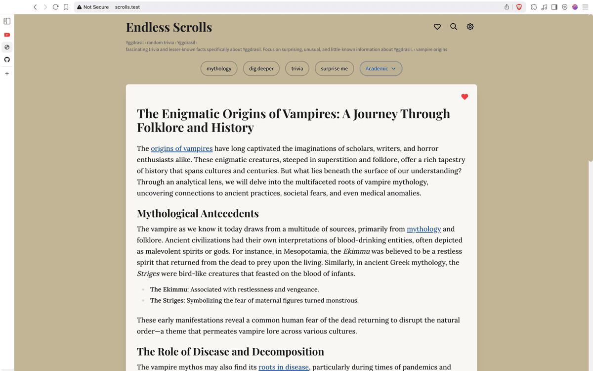

# Endless Scrolls

An interactive web explorer that presents interconnected articles with AI-generated content. Navigate through mysterious topics, uncover hidden connections, and explore knowledge through multiple writing perspectives.



## ✨ Features

### 🤖 **AI-Powered Content Generation**
- **Dynamic Article Creation**: Powered by OpenAI-compatible APIs for endless content
- **Enhanced 3-Phase Generation**: Extract facts → Generate relationships → Synthesize article
- **Smart Caching**: Articles cached for 7 days to minimize API costs
- **Progressive Enhancement**: Works without API key in demo mode

### 🎭 **Multiple Writing Styles**
Choose from 6 distinct AI personalities:
- **Dramatic**: Compelling narratives with dramatic flair
- **Academic**: Scholarly analysis and rigorous exploration
- **Mystical**: Esoteric wisdom and occult knowledge
- **Investigative**: Forensic journalism and fact-finding
- **Poetic**: Lyrical storytelling with metaphorical language
- **Scientific**: Rigorous precision with data-driven analysis

### 🔗 **Interactive Exploration**
- **Clickable Keywords**: All proper names, places, and concepts are explorable
- **Contextual Navigation**: "Dig deeper", "Trivia", "Mythology" buttons adapt to current content
- **Breadcrumb History**: Track your exploration journey
- **Favorites System**: Save interesting articles for later reference

### 🔍 **Enhanced Search**
- **Modal Search Interface**: Dedicated search experience with quick topics
- **Popular Topics**: One-click access to fascinating subjects
- **Keyboard Shortcuts**: `Cmd/Ctrl + K` for instant search

### 🛠️ **Developer Experience**
- **Developer Mode**: Advanced tools and debugging (auto-activates on localhost)
- **Keyboard Shortcuts**: Full hotkey support for power users
- **Real-time Configuration**: Hot-reload prompts and settings
- **Cache Management**: Inspect and clear article cache

## 🚀 Quick Start

### Prerequisites
- Modern web browser (Chrome, Firefox, Safari, Edge)
- OpenAI API key (optional, for dynamic content generation)

### Installation

1. **Clone the repository:**
```bash
git clone git@github.com:dotcommander/scrolls.git
cd scrolls
```

2. **Configure API access (optional):**
```bash
cp public/config.local.js.example public/config.local.js
# Edit config.local.js with your API key
```

3. **Open in browser:**
   - **Direct file**: Open `public/index.html` in your browser
   - **Local server**: Serve the `public/` directory with any web server

## 📖 Usage Guide

### Basic Navigation
- **Explore Topics**: Click any highlighted keyword to dive deeper
- **Navigate History**: Use breadcrumbs to retrace your journey
- **Save Favorites**: Click the heart icon on articles you want to keep
- **Search**: Use the search icon or `Cmd/Ctrl + K` for quick access

### AI Model Configuration
Click the model name in the footer to cycle through available models:
- `gpt-4.1`: Advanced reasoning and creativity
- `gpt-4o`: Optimized performance and speed
- `gpt-4o-mini`: Cost-effective option
- `gpt-4.1-mini`: Balanced performance

### Writing Style Selection
Click the writing style button to choose your preferred AI personality:
- Each style generates completely different perspectives on the same topics
- Styles affect tone, complexity, and approach to the subject matter
- Try different styles on the same topic for varied insights

### Developer Mode
**Activation**: Automatically on localhost or add `?dev=true` to any URL

**Keyboard Shortcuts:**
- `Cmd/Ctrl + .` - Toggle developer panel
- `Cmd/Ctrl + K` - Quick search modal
- `Cmd/Ctrl + Shift + C` - Clear all caches
- `1-6` - Quick style switching (Dramatic, Academic, Mystical, Investigative, Poetic, Scientific)
- `R` - Reload prompt configuration

## ⚙️ Configuration

### API Setup
1. Click the settings icon (⚙️) in the header
2. Enter your OpenAI API key
3. Optionally configure a custom endpoint for:
   - Local models (Ollama, etc.)
   - Corporate proxies
   - Alternative AI providers
4. Test connection before saving

### Custom Writing Styles
The application supports extensible prompt configuration:

1. **Edit prompts configuration**: `public/prompts/config.json`
2. **Create style files**: Add `.txt` files in `public/prompts/styles/`
3. **Automatic detection**: New styles appear in the UI automatically

### Enhanced Generation
Enable 3-phase generation in settings for richer, more connected content:
- **Phase 1**: Extract key facts and entities
- **Phase 2**: Generate surprising connections
- **Phase 3**: Synthesize enhanced article with deeper insights

## 🏗️ Project Architecture

```
scrolls/
├── public/
│   ├── index.html                 # Main application (single-file SPA)
│   ├── config.local.js.example    # API configuration template
│   └── prompts/
│       ├── config.json            # Prompt system configuration
│       └── styles/                # Writing style system prompts
│           ├── academic-system.txt
│           ├── conspiracy-system.txt
│           └── mystical-system.txt
├── CLAUDE.md                      # AI assistant instructions
├── LICENSE                        # MIT License
├── README.md                      # This documentation
└── screenshot.png                 # Application preview
```

### Technical Highlights
- **Zero Build Process**: Direct browser execution, no compilation required
- **Framework**: Alpine.js for reactive UI, Tailwind CSS for styling
- **Architecture**: Single-file SPA with modular prompt system
- **Storage**: Browser localStorage for settings, cache, and favorites
- **Typography**: Premium web fonts (Playfair Display, Lora, Source Sans Pro)
- **Responsive**: Mobile-first design with desktop enhancements

## 🛡️ Security & Privacy

- **Local-First**: All data stored in your browser
- **API Keys**: Never transmitted except to your configured endpoint
- **Private by Default**: No telemetry or tracking
- **Configurable Endpoints**: Support for local AI models

## 🤝 Contributing

Contributions are welcome! This project follows conventional commit standards:

1. **Fork** the repository
2. **Create** a feature branch (`git checkout -b feature/amazing-feature`)
3. **Commit** with conventional commits (`feat:`, `fix:`, `docs:`, etc.)
4. **Push** to your branch (`git push origin feature/amazing-feature`)
5. **Open** a Pull Request

### Development Guidelines
- Follow existing code style and patterns
- Test changes across different browsers
- Update documentation for new features
- Maintain the single-file architecture philosophy

## 📄 License

This project is licensed under the MIT License - see the [LICENSE](LICENSE) file for details.

## 🙏 Acknowledgments

- **Inspiration**: Interconnected wiki systems and knowledge exploration tools
- **Design Philosophy**: Questioning consensus reality through alternative perspectives
- **Technical Foundation**: Alpine.js, Tailwind CSS, and modern web standards
- **Typography**: Google Fonts for beautiful, readable text rendering

## 🔗 Links

- **Repository**: [github.com/dotcommander/scrolls](https://github.com/dotcommander/scrolls)
- **Issues**: [Report bugs or request features](https://github.com/dotcommander/scrolls/issues)
- **Discussions**: [Community discussions](https://github.com/dotcommander/scrolls/discussions)

---

*Explore. Question. Discover. The scrolls are endless.*